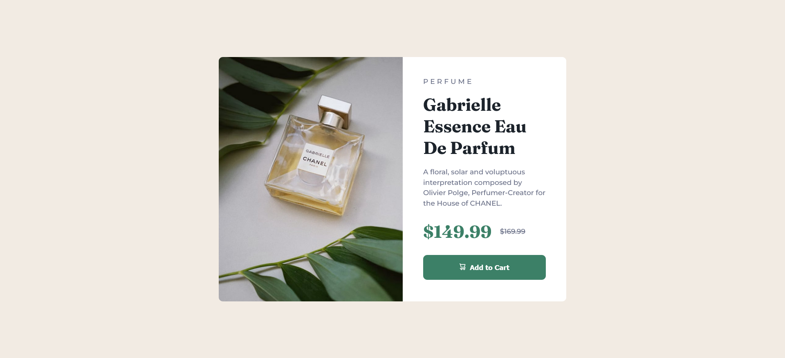

# Frontend Mentor - Product preview card component solution

This is a solution to the [Product preview card component challenge on Frontend Mentor](https://www.frontendmentor.io/challenges/product-preview-card-component-GO7UmttRfa). Frontend Mentor challenges help you improve your coding skills by building realistic projects. 

## Table of contents

- [Overview](#overview)
  - [Screenshot](#screenshot)
  - [Links](#links)
- [My process](#my-process)
  - [Built with](#built-with)
  - [What I learned](#what-i-learned)
  - [Continued development](#continued-development)
- [Author](#author)
- [Acknowledgments](#acknowledgments)

## Overview

### Screenshot



### Links

- Solution URL: [Github Repo](https://github.com/fritzadelbertus/FEM_Product-preview-card-component)
- Live Site URL: [Github Pages](https://fritzadelbertus.github.io/FEM_Product-preview-card-component/)

## My process

### Built with

- Semantic HTML5 markup
- CSS custom properties
- Flexbox
- Mobile-responsive

### What I learned

I learned that you can change image sources responsively using background url and media queries

```css
.image-box {
    background: url(/images/image-product-desktop.jpg);
}
@media screen and (max-width: 375px) {
    .image-box {
        background: url(/images/image-product-mobile.jpg);
        }
}
```
I also learned using ::before to insert icon before text
```css
.button-text::before {
    content:url('/images/icon-cart.svg');
}
```

### Continued development

CSS:
- Have a better grasp at manipulating images
- Get better at using css pseudo-selectors

## Author

- Website - [Fritz Adelbertus Sitindaon](https://www.furitsu.site)
- Frontend Mentor - [@fritzadelbertus](https://www.frontendmentor.io/profile/fritzadelbertus)

## Acknowledgments

Thank you to FrontEnd Mentor for providing this challenge. Really challenge me not to change layouts but to insert different images sources for different layouts.
